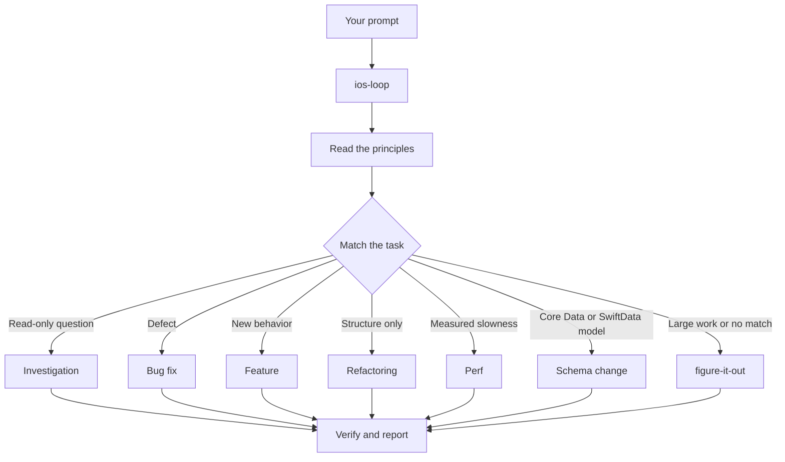

# Route work through `/ios-loop`

`/ios-loop` is the front door. You give it a goal. It matches one of its playbooks, copies that playbook's steps into the todo list, and calls the other skills as the steps need them. Every playbook ends in evidence from this checkout's own simulator. In this page you learn what a good prompt looks like, and how little of one you actually need.

Think of it as a dispatcher at a rail junction. Your prompt arrives on one track. The dispatcher reads the principles, reads the task, and throws the switch toward one gate. Every gate leads to the same platform, `/verify`.

## What happens to your prompt



The diagram shows the common routes. There are also playbooks for a UI pass, a prototype arena, visual parity, hillclimbing a metric, runtime forensics on a live hang or leak, trace forensics on a `.trace`, `.ips` or spindump someone handed you, release and App Review prep, a device run, delegating across sessions, authoring and evaluating skills, an autonomous run, babysitting a PR, shipping a verified stack, autopilot over a queue or a stack, orchestrating a long program, session pickup, pausing safely, multi-phase plans, opening a PR, and worktree cleanup. The router table in [`ios-loop`](../../template/.claude/skills/ios-loop/SKILL.md) has the full set.

## Say the goal, not the ceremony

You do not write a spec. You say what is wrong or what you want, plus anything you already know that saves the agent time.

```text
/ios-loop tapping Done on a task sometimes fires two "completed" notifications. repro first, then fix and verify.
```

That is a Bug fix prompt. "repro first" is a real constraint, not politeness, and the playbook honors it. Watch the todo list fill with the Bug fix steps. A skipped step stays visible with `skip: <reason>`.

When the conversation already carries the context, the prompt shrinks to almost nothing. All of these are enough.

```text
/ios-loop do it
```

```text
continue
```

```text
keep going until done
```

Short works because the skill stays loaded and the playbook holds the structure. Your words carry the intent, and the skill carries the rigor.

## Switch tasks with "new task"

A long session accumulates context from the last task. When you change subjects, say so.

```text
/ios-loop new task. figure out why the draft survives sign-out. don't change any code yet.
```

"new task" tells `/ios-loop` to match again rather than continue the prior playbook. "don't change any code yet" pins this one to Investigation. Without those two phrases, a session mid-Feature tends to treat your question as the next feature step.

## Give parallel work its own worktree

Two agents in one checkout fight over the working tree, over DerivedData, and over the simulator. One installs its build over the other's, and the second agent reports "my change did nothing". Ask for isolation up front.

```text
/ios-loop new task. branch off main in a fresh worktree, then port the settings screen to the new list style there.
```

`scripts/ai/worktree.sh new <name>` (or Claude Code's own `claude --worktree <name>`) gives each task its own branch, its own `.build/dd` and its own simulator, all automatic. The kit addresses every simulator by UDID, never by `booted` or by name, so two sessions never share a device. The Opening a PR playbook already works from a worktree for code changes, so mostly you only say this when a specific base matters.

Worktrees accumulate, and each one holds a simulator and gigabytes of DerivedData. When disk gets tight, ask.

```text
/ios-loop what's eating my disk? prune the worktrees that are safe to prune.
```

The Worktree cleanup playbook runs `scripts/ai/worktree.sh prune`, which gives back the worktree, simulator and DerivedData of every merged or closed PR. It keeps, and names, any worktree with uncommitted or unpushed work, and pauses for your call on those.

## Leave it running

When you step away, say what done means and go.

```text
/ios-loop i'm stepping away. keep going until no file imports the old TaskStore. log your decisions.
```

Work you will review later routes through `/figure-it-out`, which designs the run's phases and keeps a `/show-me-your-work` decision log. [Run work while you sleep](./07-overnight.md) covers the full overnight contract.

**Pitfall.** Don't enumerate skills in your prompt ("use /how, then /architect, then /arena..."). The playbook already sequences them, and a hand-written sequence usually reorders or drops steps the playbook would have kept. Name a skill only when you want to override a specific choice.

Read [`ios-loop`](../../template/.claude/skills/ios-loop/SKILL.md) itself for the full routing rules, the Xcode MCP versus shell rules, and the simulator rules.

Next is [Understand the code](./03-understand.md).
