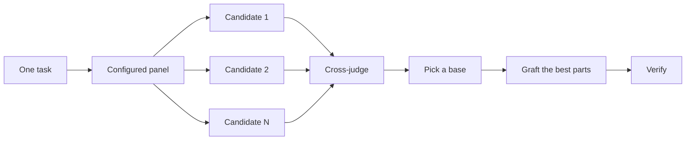

# Design before you write code

One attempt at a hard design locks in the first shape the model thought of. In an iOS app that shape is expensive to undo. A Core Data entity ships in a model version you can never edit again. An `@Observable` store's ownership spreads into every view that reads it. `/architect` settles types and boundaries before implementation. `/arena` runs several attempts at the same brief and merges the best parts. `/interrogate` has other reviewers try to break the result. When the job is coverage rather than design synthesis, `/swarm` fans out slices or races and aggregates their results.

Picture three drafting tables, each with its own model of the same bridge, and a judge with a clipboard walking between them. The judge is skeptical of all three.

## Settle the shape with `/architect`

```text
/architect design the offline queue for task edits before writing any code. i care most about how the views call it.
```

[`/architect`](../../template/.claude/skills/architect/SKILL.md) grounds itself first, running `/how` over the code the design touches and `/why` when it moves ownership or layers. Then it runs `/arena` to produce competing design sketches. Each sketch writes the caller's usage first (the SwiftUI view or the App Intent that calls it), followed by the Swift types, the signatures, which actor owns which state, and a module map. A sketch that needs a `@unchecked Sendable` or a `nonisolated(unsafe)` to compile has a design problem, and the architect says so.

By default it proceeds straight from the synthesized design into implementation. If you want to see the design first, say so.

```text
/architect with checkpoint. stop and show me before implementing.
```

## Fan out attempts with `/arena`

```text
/arena take my prompt to the arena verbatim. i want to compare their proposals with yours.
```

[`/arena`](../../template/.claude/skills/arena/SKILL.md) is the general tool underneath. N subagents attempt the same design or code brief in parallel, each in its own worktree with its own simulator. A read-only judge, on a different Claude model from the candidates when your roles allow it, scores every candidate against a rubric. The coordinator reads each candidate end to end, picks a base, grafts in the best ideas from the others, and verifies the result.



The panel's models come from `.claude/ios.env` (`MODEL_JUDGMENT`, `MODEL_CODE`), and you can adjust it per task. Ask for more candidates when the decision matters, fewer when it doesn't.

```text
/arena this, 5 candidates. the CloudKit record layout is expensive to change later.
```

When the fork is visual (two layouts for a screen, a spring versus an ease), a screenshot settles it faster than a rubric. That is the Prototype arena playbook. It builds each variant in its own worktree, captures every variant the same way, and puts them side by side with `scripts/ai/sim.sh compare` so you judge one labelled image.

## Cover slices and races with `/swarm`

```text
/swarm check every screen in .claude/ios-screens.txt at the largest accessibility text size. one worker per screen. one report.
```

[`/swarm`](../../template/.claude/skills/swarm/SKILL.md) fans N workers across independent slices, coverage matrices, gauntlet lanes, exploration partitions, or declared race arms. Each worker gets its own scope and check, then reports `PASS`, `ISSUES` or `BLOCKED`. The parent waits for the workers and returns one compact report with any gaps or dropouts.

Reach for it when parallelism buys coverage or lets independent checks race. `/arena` gives every worker the same brief, then picks a base and grafts the best parts. `/swarm` covers slices, or runs a race with a selection rule declared up front. It skips the base selection and grafting.

## Break it with `/interrogate`

```text
/interrogate the whole branch, but skeptically. no nitpicks unless it's an actual bug or regression.
```

[`/interrogate`](../../template/.claude/skills/interrogate/SKILL.md) picks the lenses the diff can fail on and sends one read-only `review-lens` reviewer per lens. The lenses are concurrency, persistence, lifecycle, UI extremes, accessibility, privacy and App Review, performance, slop and design. It runs a second Claude model on the riskiest lens. Different models have different blind spots, so a finding two reviewers raise independently is high-confidence signal. Every finding names a `file:line` and a concrete failure, like "a background `NSManagedObjectContext` save posts to a view that reads the object on the main actor". The skill verifies each one before reporting it, sorts what survives into `Act on`, `Consider`, `Noted` and `Dismissed` with a reason for each dismissal, and applies nothing on its own.

Read the dismissals too. The lead reviewer is a pragmatic senior engineer, not an oracle, and you can override it.

## How much design work does a task deserve?

You might be wondering whether every change needs this. No. Most changes need none of it. A rough ladder follows.

- A small, finished change you're unsure about needs `/interrogate` alone.
- A change that crosses a module, an actor or a persistence boundary earns `/architect`, which brings `/arena` with it.
- A standalone decision where independent attempts would help, like naming, a file format, or an algorithm, is `/arena` directly.
- A visual fork is the Prototype arena playbook.
- A coverage matrix, a set of parallel checks, or a race with declared arms is `/swarm`.
- A contested design that is expensive to reverse, such as a new Core Data model version or a CloudKit schema, gets `/architect`, then `/interrogate` before shipping.

`/ios-loop` already applies this ladder. Boundary-crossing work triggers `/architect` on its own, so you reach for these directly mainly when you want more or less scrutiny than the default.

Next is [Build and clean the change](./05-build-and-clean.md).
