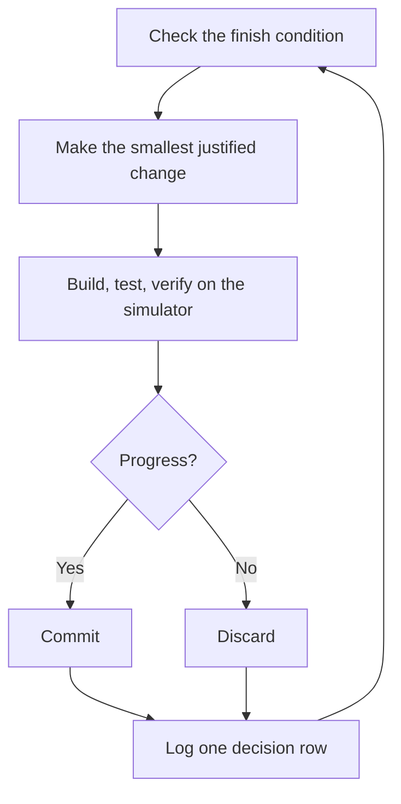

# Run work while you sleep

This is the payoff for everything before it. An agent you can trust to verify its own work on a simulator is an agent you can leave alone with a hard task. What makes that safe isn't hope. It is a checkable finish condition, an isolated worktree with its own simulator, and a decision log you audit in the morning.

Picture a factory at night. The owner waves from the door. The line keeps running under a "build loop active" sign, and one worker updates a decision board after every batch.

## The overnight contract

A good handoff has the goal, the finish condition, the limits, and an escape hatch. It doesn't need to be long.

```text
/ios-loop i'm going to bed. move every view off ObservableObject to @Observable in a fresh worktree off main.
done means zero ObservableObject conformances, scripts/ai/test.sh green, /verify passes with the AI judge's PASS on every screen.
keep a decision log. open the PR with pr.sh when done, don't merge.
/loop until done. if you're truly stuck after a few hours, stop and write up why.
```

Walk through what each line buys you.

- "i'm going to bed" tells the agent nobody will answer a question tonight. The Autonomous run playbook takes over. It parks a genuine product decision with options and a recommendation, and keeps working on everything that doesn't depend on it.
- "done means..." turns the goal into checks every iteration can run. A grep that counts conformances, a test run, a judged visual gate.
- "fresh worktree off main" keeps the run from colliding with anything else you have open. It gets its own DerivedData and its own simulator, so your morning session never finds someone else's build installed.
- "open the PR with pr.sh, don't merge" names the last step. Local edits, builds, simulator runs, commits and `pr.sh` need no approval. A push anywhere else, a merge, or deleting data does, and a prompt nobody answers stalls the night. Say what you want at the end, so the run never waits on a question.
- `/loop` is Claude Code's built-in wake mechanism, not a kit skill. The playbook uses it to re-check the finish condition, runs long builds with `run_in_background`, and watches a log with Monitor instead of polling it.
- The escape hatch lets it stop at a genuine dead end and write up why, which beats eight hours of creative goal reinterpretation.

Because you'll review this work after stepping away, `/ios-loop` routes it through [`/figure-it-out`](../../template/.claude/skills/figure-it-out/SKILL.md), which designs the run's phases before any code and wires in the decision log. A long plan with several phases gets the Multi-phase plan playbook, which checks the plan itself before the first phase starts.

If you want the run off your Mac entirely, and the work needs no Xcode (docs, scripts, String Catalogs, a mechanical refactor), hand it to a cloud session with `scripts/ai/cloud.sh "<task>"`. The session pushes its own `claude/*` branch and opens a PR that says "not compiled with Xcode". `/lead` runs `/verify` on that branch back on the Mac before it can merge.

## What the loop does all night



One change, one check, one log row, every iteration. Changes that didn't help get discarded, not left to ride. A plateau means pivot, not stop. The finish condition never quietly relaxes to declare victory, and the Stop hook never lets a turn end on a broken build.

## The morning audit

[`/show-me-your-work`](../../template/.claude/skills/show-me-your-work/SKILL.md) is what makes the run reviewable. Each row records the time, phase, decision, reason, an evidence pointer (a sheet path, a test count, a commit) and the result, in a TSV at `decisions.tsv`, or `.audit/<task-slug>.tsv` when several runs share a directory. It stays local by default. Commit it when the work is ambitious enough that a reviewer needs the trail to trust the result.

When you're back, ask for the run in review form.

```text
/show-me-your-work catch me up on what you did last night
```

Before the skill hands back its summary, it spawns a reviewer on a different Claude model to read the trail and the session transcript, and the reply ends with an Attention section listing what deserves your scrutiny. Read that section first, then the log rows it points at. `python3 scripts/ai/history.py last` shows every gate of every `/verify` the night ran. You're auditing decisions, not re-reading the whole night.

## When the night holds a queue, not a task

The contract above drives one task to one finish condition. Some nights hold more, a queue of independent changes or a whole program. Three playbooks scale the same trust up.

**Autopilot-full** runs a queue of independent changes to merged. Each item gets one owner agent that carries it through `/ship`, from build to `merge.sh`, and no owner merges on its own verdict. A fresh verifier starts a round at the owner's code-ready head, and again at every later push that changes the patch. Only a clean, judged verify on the commit that merges authorizes the merge.

```text
/ios-loop full autopilot on this queue. each item is independent. i want them merged by morning.
```

**Autopilot-stack** runs the same owner loop but lands nothing. You wake up to one linear stack of PRs on `main`, a judged `/verify` on every link, and you review and land it yourself with the Shipping playbook. Pick it over Autopilot-full when the changes are coupled, or when you want your own eyes on the work before anything merges.

```text
/ios-loop autopilot these five changes but stack them, don't ship. i'll land the stack in the morning.
```

**Orchestrate** is for a program that outlives any single agent. Multi-day work, many stacked PRs, Claude subagents and cloud sessions under one standing coordinator session. The coordinator writes briefs, hands no-Xcode units to `cloud.sh` and the rest to worktrees, collects what finishes through `prs.py`, keeps the lowest unmerged PR green, and never writes code itself. It's deliberately heavy machinery. If one agent could finish the work in a session, the playbook itself routes you back to the overnight contract above.

```text
/ios-loop orchestrate the move from Core Data to SwiftData. own it until every store is converted and merged. i'll check in twice a day.
```

**Pitfall.** A duration is not a finish condition. "work on this for 4 hours" gives the agent nothing to check, and you'll wake up to four hours of motion instead of a result. Give `/loop` a predicate that can pass or fail.

Next is [Steer with principle names](./08-principles.md).
